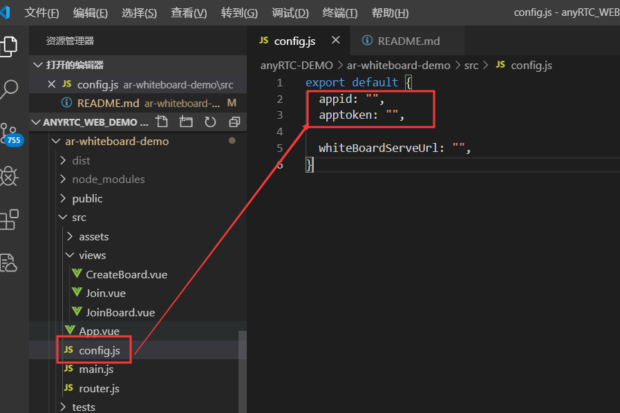

# 重要提醒
anyRTC 对该版本已经不再维护，如需互动白板方案，请前往官网联系客服获取。

**公司网址： [www.anyrtc.io](https://www.anyrtc.io)**


# ar-whiteboard

## Project configuration



## Project setup
```
npm install
```

### Compiles and hot-reloads for development
```
npm run serve
```

### Compiles and minifies for production
```
npm run build
```

### Run your tests
```
npm run test
```

### Lints and fixes files
```
npm run lint
```

### Run your end-to-end tests
```
npm run test:e2e
```

## 一、概述

### 简介

跨平台轻量级的白板SDK，易用、实时。

## 二、集成指南

### 适用范围

本集成文档适用于Web ARWhiteboard SDK 3.0.0版本。

### 导入SDK

* 安装最新版本则：

```
npm install ar-whiteboard@latest --save-dev

import Board from 'ar-whiteboard';
import 'ar-whiteboard/lib/index.css';
```


## 三、API接口文档
### ARBoard 类方法介绍
#### 1.初始化实例
##### 示例
```
let Board = new Board(DomId);
```

##### 参数
参数名 | 类型 | 描述
---|:---:|---
DomId | string | Div容器的`id`属性

##### 说明
创建画板，选择指定的容器。

#### 2. 连接画板服务
##### 示例
```
Board.initEngineWithARInfo (appId, appToken); 

```

##### 参数
参数名 | 类型 | 描述 
---|---|---
appId | String | 应用id
appToken | String | 应用的appToken

##### 说明
该方法为配置开发者信息。

#### 3. 初始化画板
##### 示例
```
Board.initWithRoomID(roomId, fileId, userId, backgroundList);
```

##### 参数
参数名 | 类型 | 描述
---|:---:|---
roomId | String | 房间号ID
fileId |String | 文件ID，唯一标识id
userId | String | 用户id
backgroundList | Array | 画板背景图URL(保证图片源允许跨域),第一次创建房间时设置背景生效，如果需要重新设置需要先销毁画板，否则取第一次设置的背景图片。

`backgroundList`每个item为一个对象，记录画板每页的背景图片，如下：

参数名 | 类型 | 描述
---|:---:|---
board_background | String | 背景图片地址
board_number |Number | 画板的页数

##### 说明
注意：该参数为画板背景图片的队列，存储着每一页的背景图片。第一次初始化时backgroundList参数为必填。当第一次初始化之后，再次初始化时不会清除上一次的画板数据，而是读取上次的数据进行渲染。

#### 4. 设置画笔的类型
##### 示例
```
Board.setBrushModel(type);
```

##### 参数
参数名 | 类型 | 描述
---|:---:|---
type |Number | 画笔的类型 `0`不可编辑`1`涂鸦(默认)`2`箭头`3`直线`4`矩形;

##### 说明
设置画笔的类型，默认`0`不可编辑。

#### 5. 预览本地音视频
##### 示例
```
Board.getBrushModel();
```

##### 说明
获取画笔的类型。

#### 6. 设置画笔的粗细
##### 示例
```
Board.setBrushWidth(width);
```

##### 参数
参数名 | 类型 | 描述
---|:---:|---
width | Number | 例如10，该值均自动转换为px。

#### 7. 获取画笔的粗细
##### 示例
```
Board.getBrushWidth();
```

##### 说明
获取画笔的类型。

#### 8. 设置画笔的颜色
##### 示例
```
Board.setBrushColor(color);
```

##### 参数
参数名 | 类型 | 描述
---|:---:|---
width | Number | 颜色的十六进制码。例如#000000,为了和移动平台的兼容性，请勿缩写为#000

##### 说明
设置画笔的颜色。 

#### 9. 获取画笔的颜色
##### 示例
```
Board.getBrushColor();
```

##### 说明
获取画笔的颜色。 

#### 10. 更新当前画板背景图片
##### 示例
```
Board.updateCurrentBgImage(BGUrl);
```

##### 参数
参数名 | 类型 | 描述
---|:---:|---
strBGUrl | String | 图片url

#### 11. 获取当前画板的背景图片URL
##### 示例
```
Board.getCurrentBgImageURL();
```

##### 说明
获取当前画板的背景图片URL

#### 12. 在当前画板之前或之后插入一个新的画板
##### 示例
```
Board.addBoard(addAfter, boardBGUrl);
```

##### 参数
参数名 | 类型 | 描述
---|:---:|---
addAfter | Number | `0`表示在当前画板之前插入，`1`表示在当前画板之后插入
boardBGUrl | String | 插入新画板的背景图片URL(保证图片源允许跨域)

#### 13. 删除当前页的画板
##### 示例
```
Board.deleteCurrentBoard();
```

##### 参数
参数名 | 类型 | 描述
---|:---:|---
type | Number | 自定义共享通道标识id

#### 14. 切换到上一页
##### 示例
```
Board.prePage(needSync);
```

##### 参数
参数名 | 类型 | 描述
---|:---:|---
needSync | Boolean | `true`其他端的画板同步滑动到上一页，false`仅本地滑动到上一页

#### 15. 切换到下一页
##### 示例
```
Board.nextPage(needSync);
```

##### 参数
参数名 | 类型 | 描述
---|:---:|---
needSync | Boolean | `true`其他端的画板同步滑动到下一页，false`仅本地滑动到上一页

#### 16. 滑动画板到第几页
##### 示例
```
Board.switchPage(needSync, page);
```

##### 参数
参数名 | 类型 | 描述
---|:---:|---
needSync | Boolean | `true`其他端的画板同步滑动到指定页，`false`仅本地滑动到指定页
page | Number | 滑动画板到第几页

#### 17. 发送用户实时消息
##### 示例
```
Board.sendMessage(message);
```

##### 参数
参数名 | 类型 | 描述
---|:---:|---
message | String | 消息文本，推荐json字符串拓展性极佳

#### 18. 设置画板大小
##### 示例
```
Board.setCanvasSize(width, heigh);
```
##### 参数
参数名 | 类型 | 描述
---|:---:|---
width | Number | 画板将要设置的宽度
heigh | Number | 画板将要设置的高度

##### 说明
设置画板大小，当尺寸变化，或者放大缩小时调用。结合`window.onresize`使用。

#### 19. 设置画板比例
##### 示例
```
Board.setBoardScale(scale);
```

##### 参数
参数名 | 类型 | 描述
---|:---:|---
scale | Number | 画板放大比例，1~3倍

##### 说明
设置画板大小，当尺寸变化，或者放大缩小时调用。

#### 20. 撤销画笔
##### 示例
```
Board.undo();
```

##### 说明
撤销画笔,撤销当前画板上自己的画笔,逐条撤销。

#### 21. 销毁画板
##### 示例
```
Board.destoryBoard();
```

##### 说明
清除所有画板的笔迹以及背景图片。

#### 22. 清除所有画板笔迹
##### 示例
```
Board.clearAllDraws();
```

##### 说明
清除所有画板绘画的笔迹。

#### 23. 清除当前画板所有笔迹
##### 示例
```
Board.clearCurrentDraw();
```

##### 说明
清除当前画板所有笔迹。

#### 24. 离开画板
##### 示例
```
Board.leave();
```

##### 说明
离开画板（房间）。

### ARBoardKitDelegate 接口类
#### 1. 画板断开连接
##### 示例
```
Board.on('onBoardServerDisconnect', () => {});
```

#### 2. 监听画板变化
##### 示例
```
Board.on('onBoardPageChange', (index, totalIndex, currentBgUrl) => {});
```
##### 参数

参数名 | 类型 | 描述
---|:---:|---
index | Number | -
totalIndex | Number | 画板总页数
currentBgUrl | String | 当前画板背景图片URL

##### 说明
监听画板变化，当画板发生变化，将会收到该回调（例如翻页、添加一页、删除一页、背景图片更新等等。

#### 3. 收到广播消息
##### 示例
```
Board.on('onBoardMessage', (message) => {});
```

##### 参数

参数名 | 类型 | 描述
---|:---:|---
message | String | 广播消息主体

##### 说明
收到广播的消息，消息主体为sendMessage时发送的字符串，此处推荐json字符串，可以和业务系统高效的配合。例如：指定用户接收消息、踢人（判断字段中是否有自己的userid即可）等等。

#### 4. 画板实时变化时间戳回调
##### 示例
```
Board.on('onBoardDrawsChangeTimestamp', (timestamp) => {});
```

##### 参数
参数名 | 类型 | 描述
---|:---:|---
timestamp | String | 时间戳

##### 说明
主持人监听并实现录制，非主持人不做处理。

#### 5. 画板被摧毁
##### 示例
```
Board.on('onBoardDestroy', () => {});
```

##### 说明
画板已被摧毁。

#### 6. 更改画板背景
##### 示例
```
Board.on('update_board_background', (res) => {});
```

##### 说明
更改画板背景, `res.code` 为0说明更改成功。


#### 7. 监听画板错误
##### 示例
```
Board.on('onBoardError', (error) => {});
```

##### 参数

参数名 | 类型 | 描述
---|:---:|---
error | String | 错误码

##### 说明
监听画板错误详情参考错误码对照表。


## 四、更新日志

**Version 3.0.0 （2019-04-11）**

* SDK版本升级3.0，API接口变更，更加简洁规范

## 五、错误码对照表

以下为介绍 Web ARWhiteBoard SDK 的错误码。

code           | Desciption
---|---
ARBoardCodeParameterError | 参数为空或者参数错误
ARBoardCodeNoNet | 当前无网络
ARBoardCodeSessionPastDue | Session已过期
ARBoardCodeDeveloperInfoError | 开发者信息错误
ARBoardCodeDeveloperArrearage | 账号欠费
ARBoardCodeDeveloperNotOpen | 该功能未开通
ARBoardCodeDatabaseError | 数据库异常
ARBoardCodeBackgroundListIsNull | 背景图片队列为空
